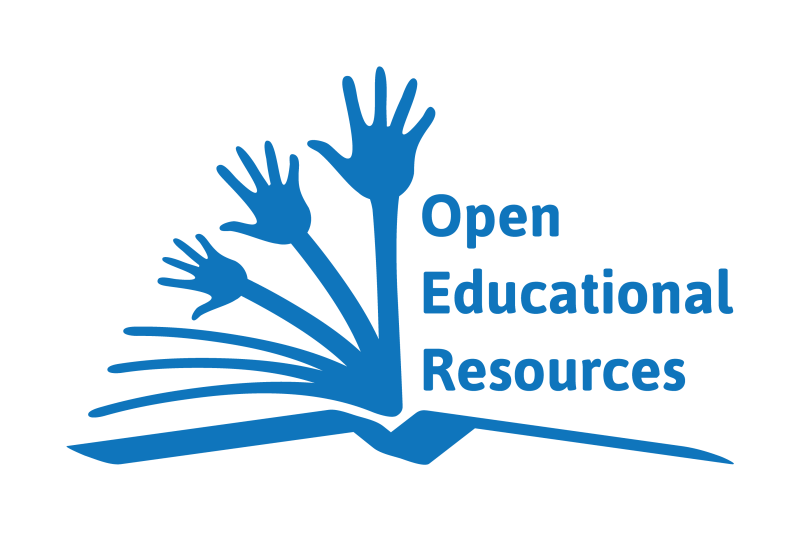
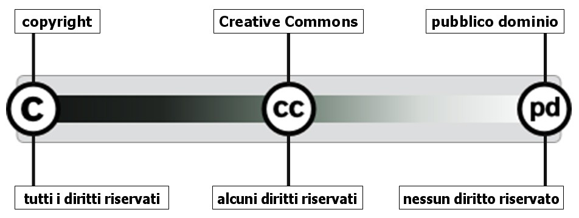
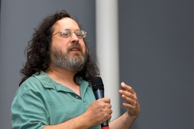

% Open Educational Resources
% Loris Tissino
   @loristissino 
  _loris@tissino.it_
% Marzo/Aprile 2017

# OER?

##

## Risorse didattiche aperte

Materiali didattici in formato digitale  
resi disponibili con licenze che ne permettono   
il riutilizzo, la modifica e la distribuzione

## Due termini particolari

_Open_ e _Free_

## _Open_

_Open_ (aperto) può significare diverse cose:

- apertura giuridica
- apertura tecnica
- accesso senza vincoli

## _Free_

_Free_ può significare:

- gratuito
- libero

## Apertura giuridica

Licenza aperta (es. Creative Commons)

## Apertura tecnica

Accesso al codice sorgente o ai materiali di base

## _Copyright_ e _Copyleft_

Il _copyright_ è stato introdotto a inizio '700 per incentivare la\ pubblicazione di opere riducendo la possibilità di copia.

Il _copyleft_ usa le leggi relative al copyright per consentire esplicitamente la duplicazione e il riuso delle opere.

Da «*All* rights reserved» a «*Some* rigths reserved»

## Pubblico dominio

Le opere sono di pubblico dominio dopo un\ certo numero di\ anni dalla morte dell'autore o\ per\ esplicita rinuncia.

## 

## Concetti collegati

- [brevetti](https://it.wikipedia.org/wiki/Brevetto)
- [marchi](https://it.wikipedia.org/wiki/Marchio)
- [privacy](https://it.wikipedia.org/wiki/Privacy), riservatezza e dati personali
- [_netiquette_](https://it.wikipedia.org/wiki/Netiquette)

# Storia

## 560

[Columba di Iona](https://it.wikipedia.org/wiki/Columba_di_Iona) e la disputa del libro

>“In base alla pretesa del mio amico si dovrebbe applicare una vecchia legge a una nuova realtà. I libri sono diversi rispetto agli altri beni e la legge dovrebbe tenere questo fatto in considerazione. Uomini istruiti come noi, che hanno ereditato conoscenza tramite libri, hanno l'obbligo di diffondere tale conoscenza, copiando i libri in lungo e in largo. Copiandolo, non ho consumato il libro di Finnian: lui possiede ancora l'originale, che non è in nulla peggiore per il fatto che io l'abbia copiato; né il suo valore è diminuito. (...) Ho agito per il bene della società in generale e né Finnian né il suo libro sono stati danneggiati.”

## 1709

[Statuto di Anna](https://it.wikipedia.org/wiki/Statuto_di_Anna),  
prima legge sul Copyright

_An Act for the Encouragement of Learning, by vesting the Copies of Printed Books in the Authors or purchasers of such Copies, during the Times therein mentioned_

## 1983

Richard Stallman avvia il progetto GNU   
per la realizzazione di un sistema operativo libero

## 1989

La [Free Software Foundation](http://www.fsf.org/) implementa la  
GNU GPL (General Public License)  

[Quattro libertà](https://www.gnu.org/philosophy/free-sw.it.html):

- eseguire il programma per qualsiasi scopo
- studiare il programma e modificarlo
- ridistribuire copie del programma
- migliorare il programma e distribuirne pubblicamente i miglioramenti

## 1991

Linus Torvalds rilascia la prima versione di (_GNU/_)Linux,  
nucleo di un sistema operativo, con licenza GPL

## 1994

Wayne Hodgins conia il termine [Learning Object](https://en.wikipedia.org/wiki/Learning_object)

Unità di istruzione per l'_e-learning_:

- "scropribile" (metadati)
- riutilizzabile (diversi contesti)
- interoperabile (diverse piattaforme)

## 1998

David Wiley conia il termine [open content](https://en.wikipedia.org/wiki/Open_content)

- Retain
- Reuse
- Revise
- Remix
- Redistribute

## 1999/2000 

[GNU Free Documentation License](https://en.wikipedia.org/wiki/GNU_Free_Documentation_License)

Licenza _copyleft_ per documentazione del\ software, manuali, libri\ di\ testo, ecc.

## 2001 

Nasce [Wikipedia](https://en.wikipedia.org)

## 2001

Il MIT parte con l'[OpenCourseWare](https://ocw.mit.edu/index.htm)

## 2002

Prima versione delle licenze [Creative Commons](https://creativecommons.org/)

## 2002 

L'UNESCO definisce il concetto di [Open\ Educational\ Resource](http://www.unesco.org/new/en/communication-and-information/access-to-knowledge/open-educational-resources/)

## 2006

Definizione delle ["opere culturali libere"](https://en.wikipedia.org/wiki/Definition_of_Free_Cultural_Works)

- libertà d'uso
- libertà di studio
- libertà di fare e ridistribuire copie
- libertà di fare modifiche e miglioramenti, ridistribuendole

(da [FreedomDefined](http://freedomdefined.org/Definition))

## 2007

Wikimedia Foundation adotta le licenze CC  
per i contenuti di Wikipedia

## 2008

Iniziano ad essere organizzati i [MOOC](https://en.wikipedia.org/wiki/Massive_open_online_course),  
_Massive Open Online Courses_

# Vantaggi

## Risparmio di tempo

Si trovano cose già pronte e fatte bene

## Aggiornamento

Le risorse aperte spesso risultano più aggiornate

## Punti di vista diversi

Si possono trovare approcci didattici diversi dal proprio

# Licenze

## Guide per gli autori

[Choose a License](https://choosealicense.com/)

## Guide per gli utilizzatori

[TL;DR](https://tldrlegal.com/licenses/browse)

## Open Hardware

[Open Source Hardware Definition](https://www.oshwa.org/definition/)

# Produzione

## In un mondo ideale...

- sistemi di controllo di versione
- possibilità di:
    - _forking_
    - rigenerazione
    - accesso non solo al prodotto finito

# MOOC

## MOOC

## MOOC e OER

La _O_ di MOOC e quella di _OER_ sono diverse

MOOC: _Chiunque può accedere_  
(non ci sono prerequisiti formali)  

OER: _Il materiale è "aperto"_  
(distribuibile, adattabile, ecc.)

# Raccolte

## OERCommons

[OERCommons](https://www.oercommons.org)

## Wikibooks e Wikiversità

[Wikibooks](https://it.wikibooks.org)  
[Wikiversità](https://it.wikiversity.org)

## Altre...

- [EdShelf](https://edshelf.com/)
- [MERLOT](https://www.merlot.org)
- [Edutopia](http://www.edutopia.org/open-educational-resources-guide)
- [EnergizeEducation](http://energizeeducation.org/)
- [Essediquadro](http://sd2.itd.cnr.it/)
- [M_Learning class](http://mlearning.isitgoonair.net/)

# Colophon

## Sorgente

[Questo documento](https://raw.githubusercontent.com/loristissino/oer/master/index.md)

## Strumenti

- [Reveal.js](http://lab.hakim.se/reveal-js)
- [Pandoc](http://www.pandoc.org)

## Riconoscimenti

Molte delle idee e dei link provengono dal MOOC  
[Education: OER101 Using Open Educational Resources in Teaching](https://www.pok.polimi.it)

Il testo su Columba di Iona è adattato da [Colmcille and the Battle of the Book: Technology, Law and Access to Knowledge in 6th Century Ireland](http://oro.open.ac.uk/10332/)

Per le immagini, vedi [credits.txt](https://raw.githubusercontent.com/loristissino/oer/master/credits.txt)

## Approfondimenti

Richard Stallman, [L'interpretazione sbagliata del copyright - una serie di errori](http://www.gnu.org/philosophy/misinterpreting-copyright.it.html)

Simone Aliprandi, [Creative Commons: manuale operativo](http://ledibooks.com/creativecommons/)

Simone Aliprandi, [Capire il Copyright](http://www.copyleft-italia.it/libri/capire-copyright-2012.html)

[FAQ sul diritto d'autore](http://www.scarichiamoli.org/main.php?page=faq2)

Antonio Fini, [Risorse Educative Aperte Open Educational Resources OER](https://docs.google.com/presentation/d/18oZDSFFS25v7RR7nGSIFM6mDBSFNwg7gPgoPloVCTuw/edit#slide=id.gefe496976_0_444), CC BY 4.0

[Contenuti digitali aperti tra licenze, inclusione e riuso](https://www.mindomo.com/it/mindmap/contenuti-digitali-aperti-tra-licenze-inclusione-e-riuso-6a46a306c55c43f1a95e6b4e11acaea5)

## Licenza

 «Open Educational Resources» di <a xmlns:cc="http://creativecommons.org/ns#" href="http://www.tissino.it/oer/" property="cc:attributionName" rel="cc:attributionURL">Loris Tissino</a> è distribuito con Licenza  <a rel="license" href="http://creativecommons.org/licenses/by-sa/4.0/">Creative Commons Attribuzione Condividi allo stesso modo 4.0 Internazionale</a>.

